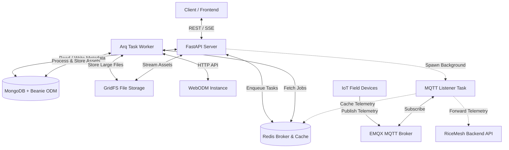

# RiceMesh GIS and Map Processing

This repository contains the GIS and Map Processing module for the **RiceMesh** project. RiceMesh is a farming assistance system designed to help farmers monitor rice paddy irrigation, route dynamically between farm plots, and process mapping datasets.

This module provides a FastAPI web server and an asynchronous Arq background worker to manage drone video uploads, parse frames, interface with WebODM to generate GIS assets (Orthophotos and Digital Terrain Models), cache IoT telemetry data from EMQX, and calculate optimal paths between farm plots.

---

## Project Architecture

The system is built on a decoupled architecture consisting of a FastAPI web application, an asynchronous task worker, multiple datastores, and an MQTT broker.



### Core Components

1. **FastAPI Web Server (`src/server/`)**
   * Serves HTTP REST endpoints and Server-Sent Events (SSE) progress streams.
   * Interfaces with MongoDB via Beanie ODM and GridFS.
   * Provides routing calculation services, dynamic MQTT topic subscriptions, and asset serving.

2. **Arq Background Task Worker (`src/arq_worker/`)**
   * Runs asynchronous background jobs offloaded from the FastAPI server.
   * Manages CPU-bound operations (such as frame extraction via OpenCV) in a dedicated thread pool to keep the event loop unblocked.
   * Manages long-running WebODM pipeline workflows (uploading frames, tracking progress, and downloading output assets).

3. **MongoDB + GridFS (`src/db/`)**
   * Stores application documents (videos, parsed images, job logs, and WebODM tasks) using Beanie ODM.
   * Utilizes GridFS to store large binary datasets, such as raw MP4 video files, parsed PNG frames, and output Georeferenced TIFF files (Orthophotos/DTMs).

4. **Redis Cache & Broker**
   * Acts as the backend message broker for the Arq task queue.
   * Caches active worker job progress state and active MQTT telemetry topics.

5. **EMQX MQTT Broker & Telemetry Listener (`src/modules/`)**
   * Brokers incoming messages from IoT field devices monitoring paddy status.
   * Runs a persistent `MQTTListener` background service that decodes sensor readings, caches them to Redis, and forwards structured telemetry to the main RiceMesh backend API.

6. **Floyd-Warshall Pathfinding Engine (`src/modules/floyd_warshall.py`)**
   * Computes shortest paths between farm plots.
   * Custom edge weight calculation takes into account plot area, water deficit (optimal water height vs. current height), and elevation penalties (prioritizing downhill/gravity flow).

---

## Core Pipelines

### 1. Video-to-Map Pipeline
1. **Upload**: The client uploads an MP4 drone video and an optional subtitle file (`.srt` containing GPS telemetry logs). The file is saved temporarily and enqueued for GridFS upload.
2. **Parsing & Geotagging**: The worker extracts frames at a configurable interval using OpenCV. If an `.srt` file is present, the worker parses the subtitle timestamps and interpolates the corresponding GPS coordinates (longitude, latitude, elevation, roll, pitch, yaw) to geotag each frame as a `ParsedImage`.
3. **WebODM Processing**: Geotagged frames are zipped and uploaded to WebODM. The worker polls WebODM's task progress. Once completed, it downloads the generated Orthophoto and Digital Terrain Model (DTM) `.tif` assets and stores them in GridFS.

### 2. Telemetry Pipeline
1. On startup, the application queries the RiceMesh Backend API for active device topics.
2. It launches a persistent MQTT client subscribing to EMQX.
3. Telemetry payloads containing sensor readings are cached in Redis and forwarded to the backend telemetry records API.

### 3. Plot Routing Pipeline
1. The pathfinding endpoint receives a list of plots (with area, water height, optimal height, elevation) and connections (distances).
2. It computes directional weights dynamically, penalizing uphill paths and rewarding routing to water-deficient plots.
3. It runs the Floyd-Warshall algorithm to find all-pairs shortest paths and can reconstruct specific routes between source and target plots.

---

## Requirements

### System Prerequisites
* **Operating System**: Linux (recommended)
* **Python**: `^3.12`
* **Package Manager**: `uv` (Fast Python package manager)
* **Docker & Docker Compose** (for running MongoDB, Redis, and EMQX)
* **WebODM**: A running WebODM instance (local or remote)

### Key Python Dependencies
* `fastapi` & `uvicorn` (Web API hosting)
* `arq` (Async job queuing)
* `motor` & `beanie` (Async MongoDB ODM)
* `opencv-python` (Frame extraction)
* `aiomqtt` (Asynchronous MQTT subscriber)
* `rasterio` & `shapely` & `pyproj` (Geospatial and coordinate transformation utilities)
* `pillow` (Image preview processing)

---

## Environment Configuration

Create a `.env` file in the root directory based on `.env.example`:

| Variable | Description |
| :--- | :--- |
| `UPLOAD_TMP` | Temporary storage directory for uploaded video files. |
| `PARSE_TMP` | Temporary storage directory for extracted frame images. |
| `WEBODM_ROOT` | URL of the WebODM instance (e.g. `http://localhost:8000`). |
| `WEBODM_USER` | Username for WebODM authentication. |
| `WEBODM_PASS` | Password for WebODM authentication. |
| `SERVER_PORT` | Port for the FastAPI server (default is `8001`). |
| `MONGO_ROOT_USER` | Root username for the MongoDB container. |
| `MONGO_ROOT_PASS` | Root password for the MongoDB container. |
| `DATABASE` | Name of the MongoDB database. |
| `REDIS_HOST` | Hostname of the Redis server. |
| `REDIS_PORT` | Port of the Redis server. |
| `EMQX_MQTT_HOST` | Hostname of the EMQX MQTT broker. |
| `EMQX_MQTT_PORT` | Port of the EMQX MQTT TCP listener (default `1883`). |
| `RICEMESH_API_HOST` | Hostname of the main RiceMesh Backend API. |
| `RICEMESH_API_EMAIL` | App email to authenticate with RiceMesh Backend API. |
| `RICEMESH_API_PASS` | App password to authenticate with RiceMesh Backend API. |

---

## Installation & Setup

1. **Clone the repository**:
   ```bash
   git clone <repository_url>
   cd ricemesh-gis-processing
   ```

2. **Install Python Dependencies**:
   This project uses `uv` to manage the virtual environment. Install dependencies with:
   ```bash
   uv sync
   ```

3. **Configure Environment**:
   Copy `.env.example` to `.env` and fill in the details:
   ```bash
   cp .env.example .env
   ```

4. **Launch Infrastructure Services**:
   Start MongoDB, Redis, and EMQX in the background:
   ```bash
   docker compose --profile dev up -d
   ```

5. **Run WebODM**:
   Follow the [WebODM Installation Guide](https://github.com/OpenDroneMap/WebODM#getting-started) to run WebODM using Docker. Ensure it is accessible on the host and port specified in your `.env` (typically `http://localhost:8000`).

---

## Running the Application

Always run the Python modules within the virtual environment using `uv run`. 

Start the services in the following order:

1. **FastAPI Web Server**:
   ```bash
   bash 1-server-run.bash
   ```
   *(Runs: `uv run uvicorn server.server:gisProc --app-dir src/ --port 8001`)*

2. **Arq Background Task Worker**:
   ```bash
   bash 2-arq-worker.bash
   ```
   *(Runs: `uv run arq arq_worker.settings.WorkerSettings`)*

---

## API Endpoints

### 1. Video Operations (`/api/video-ops`)
* `POST /api/video-ops/upload`: Upload video and SRT files. Returns a job ID.
* `POST /api/video-ops/parse`: Parse an uploaded video file to extract frames.
* `POST /api/video-ops/webodm`: Submit parsed frames to WebODM to run mapping task.
* `GET /api/video-ops/jobs/{job_id}`: Poll background task status.
* `GET /api/video-ops/jobs/{job_id}/stream`: SSE stream to push progress notifications.
* `GET /api/video-ops/get/{owner_id}`: List uploaded videos for a specific owner.
* `GET /api/video-ops/parsed`: List metadata for parsed frames.
* `PUT /api/video-ops/videos/{video_id}/srt`: Update the SRT subtitle contents.

### 2. WebODM API Wrapper (`/webodm`)
* `POST/GET /webodm/projects`: Manage WebODM mapping projects.
* `POST/GET /webodm/projects/{project_id}/tasks`: Manage WebODM task runs under a project.
* `GET /webodm/projects/{project_name}/tasks/{task_id}/stream`: Stream real-time WebODM processing console output via SSE.
* `GET /webodm/projects/{project_name}/tasks/{task_name}/dtm`: Extract digital terrain model elevation data.

### 3. Processed Maps (`/api/processed-map`)
* `GET /api/processed-map/download`: Download the raw georeferenced TIFF file.
* `GET /api/processed-map/display`: Retrieve a resized JPEG preview, containing georeferencing coordinate bounds, CRS, and transform details in response headers (`X-Raster-Bounds`, `X-Raster-CRS`, `X-Raster-Transform`).

### 4. Floyd-Warshall Routing (`/api/floydwarshall`)
* `POST /api/floydwarshall/run`: Execute all-pairs shortest paths using an explicit adjacency/distance matrix.
* `POST /api/floydwarshall/matrix`: Calculate path weights using plot metrics (elevation, area, water deficit) and return successor routing details.
* `POST /api/floydwarshall/matrix/multi-target`: Run routing with multiple targets.
* `POST /api/floydwarshall/matrix/chained-routes`: Compute routes across a sequence of plots.

### 5. Telemetry & Utilities
* `POST /api/mqtt/subscribe`: Instruct the listener to subscribe to a new MQTT topic dynamically.
* `GET /api/debug/redis/keys`: List cached Redis keys.
